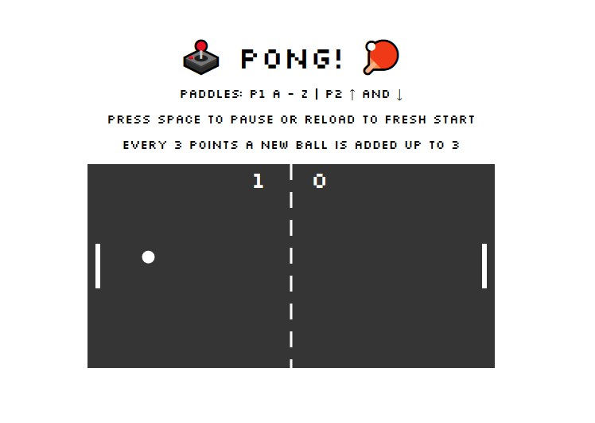

### Pong Game

The game consists in the rebuild of the Classic Pong Game. The game starts with one ball and after 3 points, a new ball will appear with more speed and smaller to make the game more challenging.

### Technologies used

The text processor used was:

- Microsoft Visual Studio Code

The languages used were:

- HTML
- CSS
- JavaScript

# Pong Game Starter

A starter project for a basic pong game using SVGs.

### Project Comp

## Setup

Ensure you have [Node.js](https://nodejs.org/en/) installed first.

**Install dependencies:**

`$ npm install`

**Run locally with the Parcel dev server:**

`$ npm start`

Once you run the start command you can access your project at http://localhost:3000